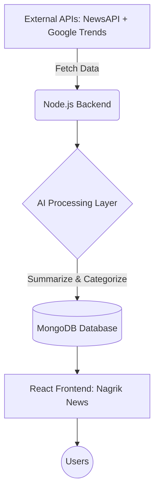

# 📰 NAGRIK NEWS: AI-Powered Smart News Portal
## Project Overview & Proposal

**A Complete Blueprint for a Next-Generation Journalism Platform**

---

### 🎯 1. PROJECT OVERVIEW
**NAGRIK NEWS** is a state-of-the-art AI-powered News Portal designed to revolutionize how people consume news. It bridges the gap between traditional journalism (like Dainik Bhaskar) and modern AI technology.

**Key Capabilities:**
- 📰 Fetches news from Real-Time News APIs.
- 📈 Detects and highlights Trending Topics via Google Trends.
- 🧠 Summarizes long-form news using Advanced AI models.
- 👤 Delivers a Personalized News Feed for every user.
- ✍️ Provides a robust Internal CMS for Reporters and Editors.

**Our Goal:** To upgrade the traditional news delivery experience into a fast, smart, and highly personalized AI-driven platform.

---

### 🏗️ 2. TECH STACK (Optimized & Scalable)
**Frontend:**
- React.js (Vite)
- Tailwind CSS & Shadcn UI (for premium, modern aesthetics)

**Backend:**
- Node.js + Express.js

**Database:**
- MongoDB Atlas (Cloud NoSQL)

**APIs & AI:**
- NewsAPI & Google Trends API
- Hugging Face / OpenAI (for Summarization & Chatbot)

**Deployment:**
- Vercel (Frontend)
- Render (Backend)

---

### ⚙️ 3. SYSTEM ARCHITECTURE

---

### 👥 4. USER ROLES
- **🧑‍💻 Reporter:** Writes news and saves drafts.
- **✏️ Editor:** Reviews, edits, and approves news drafts.
- **👑 Admin:** Manages users, publishes final articles.
- **🌍 Public User:** Reads news and interacts with the personalized feed.

---

### 📰 5. CORE FEATURES
#### 🟢 A. News System
- Real-time instant news fetch.
- Smart category-based navigation.
- Advanced global search functionality.

#### 🔵 B. CMS (Content Management System)
- Intuitive dashboard to Create/Edit/Delete news.
- Seamless image upload and management.
- Complete workflow: Draft → Pending Review → Published.

#### 🔴 C. Trending System
- Real-time synchronization with Google Trends.
- Dedicated section for viral and breaking topics.

#### 🟣 D. AI Features (Our Main USP 🔥)
- **🧠 AI Summarizer:** Converts lengthy articles into quick, readable summaries.
- **🤖 AI Chatbot:** An interactive assistant to explain complex news topics.
- **🎯 Personalized Feed:** AI-curated news based on individual user interests.
- **🏷️ Auto Categorization:** Automatically assigns the most relevant categories using NLP.
- **⚠️ Fake News Detection:** Analyzes authenticity and highlights potential misinformation.

#### ⚡ E. Automation
- Cron jobs for automated news fetching and trending updates.
- Scheduled publishing for timed releases.

---

### 🎨 6. FRONTEND MODULES
- Dynamic Homepage (Top stories, AI Summaries)
- Immersive Article Page (Read full or Summary)
- Customized Category & Search Pages
- Dedicated Trending Section
- Powerful Admin/Reporter Dashboard

---

### 🔐 7. SECURITY FEATURES
- JWT Authentication for secure login.
- Strict Role-Based Access Control (RBAC).
- Encrypted and secure API endpoints.

---

### 📈 8. MONETIZATION STRATEGY
- **Ads:** Google AdSense integration.
- **Sponsored Content:** Native advertising spaces.
- **Premium Subscription:** Ad-free experience with exclusive AI features (Future Roadmap).

---

### 💡 9. UNIQUE SELLING POINT (USP)
This is **NOT** a normal news website. This is an **"AI-Powered Smart News Platform"**.
- Faster news delivery.
- Smart, digestible summaries.
- Content that adapts to the reader (Personalization).
- Trending insights at a glance.

---

### 🎯 10. FINAL CONCLUSION
**NAGRIK NEWS** represents the future of journalism. It combines traditional reporting rigor with cutting-edge AI capabilities, offering real-time updates and unprecedented personalization. It is designed to be highly scalable and can rapidly grow into a startup-level product.

---
*Created for the visionary goal of revolutionizing the digital news media space.*
